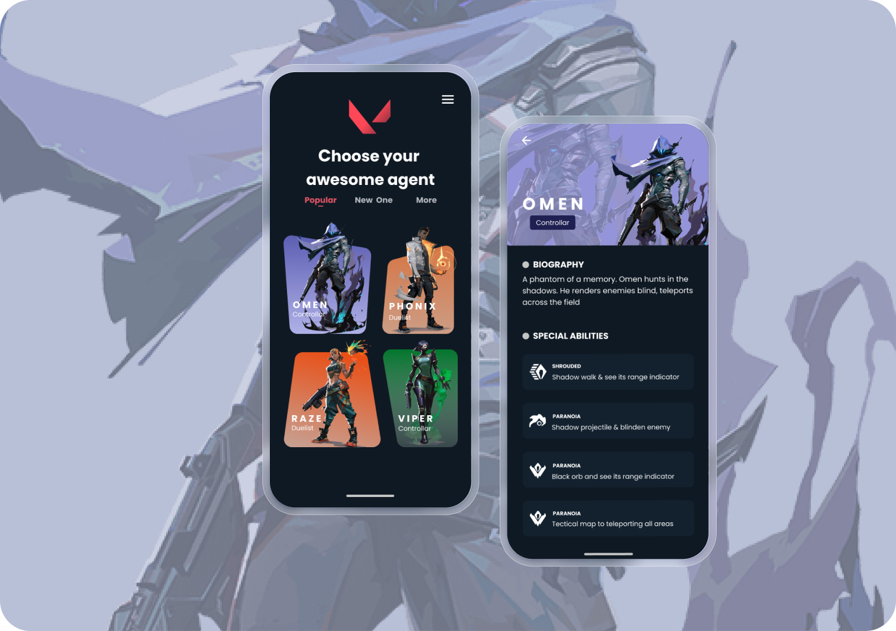
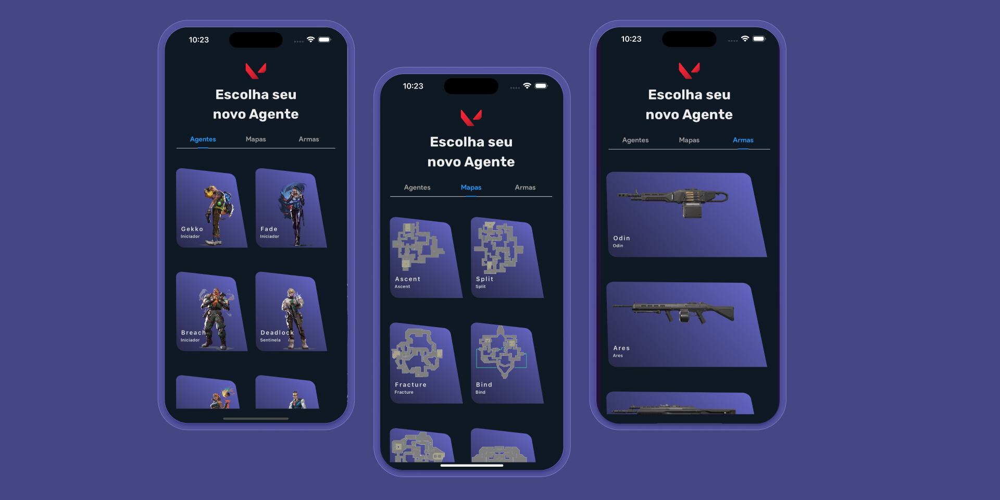

<div align="center">

# Valorant Guide

**A complete companion app for Valorant — agents, weapons, maps, and live player stats.**

A Flutter mobile app that aggregates official Riot game data and live player performance into a single, beautifully designed reference. Originally published on the Google Play Store.

[](https://flutter.dev)
[](https://dart.dev)
[](https://pub.dev/packages/get)
[](https://www.mozilla.org/en-US/MPL/2.0/)
[]()
[]()

</div>

---

## Overview

**Valorant Guide** is a mobile companion app for players of Riot Games' tactical shooter *Valorant*. It pulls data from two public APIs to deliver an at-a-glance reference for the game's content and live player statistics:

- **[valorant-api.com](https://valorant-api.com)** — official agents, weapons, skins, and maps
- **[Henrik-3rd-party API](https://docs.henrikdev.xyz)** — live player accounts, ranks, and recent matches

This project was **published on the Google Play Store** as a personal portfolio piece and serves as a practical demonstration of Clean Architecture, GetX state management, and REST integration in production-grade Flutter.

### Key Features

- **Agents Catalog** — Browse all Valorant agents with abilities, lore, and role classification
- **Weapons & Skins** — Detailed weapon stats with damage range charts and skin galleries
- **Maps Library** — Tactical map layouts and callouts for every battlefield
- **Player Lookup** — Search any player by Riot ID and view their competitive rank
- **Match History** — Inspect recent matches with per-round breakdowns and player performance
- **Localized Content** — Game data fetched in `pt-BR` from Riot's API
- **Polished UI** — Custom typography (Rubik, Product Sans), sidebar navigation, full-screen image viewers, and shimmer loading states

## Screenshots

<div align="center">

### Design Reference


*Design inspired by [Malik Abimanyu's Dribbble shot](https://dribbble.com/shots/14073476-Valorant-Agents).*

### App Implementation


</div>

## Tech Stack

| Layer | Technology |
|-------|-----------|
| Framework | [Flutter](https://flutter.dev) (Dart 3.10+) |
| State Management | [GetX](https://pub.dev/packages/get) (`get: 4.6.6`) |
| HTTP Client | [Dio](https://pub.dev/packages/dio) + [Retrofit](https://pub.dev/packages/retrofit) |
| Local Storage | [GetStorage](https://pub.dev/packages/get_storage) |
| Functional Types | [Dartz](https://pub.dev/packages/dartz) (`Either<Failure, T>`) |
| Image Caching | [cached_network_image](https://pub.dev/packages/cached_network_image) |
| UI Extras | [SidebarX](https://pub.dev/packages/sidebarx), [Shimmer](https://pub.dev/packages/shimmer), [flutter_svg](https://pub.dev/packages/flutter_svg), [video_player](https://pub.dev/packages/video_player) |
| Code Generation | [build_runner](https://pub.dev/packages/build_runner) + [json_serializable](https://pub.dev/packages/json_serializable) |

## Architecture

The app follows **Clean Architecture** with feature modules. Each module owns its own `data`, `domain`, and `presentation` layers, keeping responsibilities isolated and testable.

```
UI (View) → Controller (GetX) → UseCase → Repository (interface)
                                            ↓
                                      Repository (impl)
                                            ↓
                                       DataSource → Dio → REST API
```

The domain layer is pure Dart — no Flutter or third-party imports — so business logic stays portable and easy to test. Failures are modeled with `Either<Failure, T>` from Dartz instead of throwing exceptions.

## Project Structure

```
lib/
├── main.dart
└── app/
    ├── core/
    │   ├── constants/         # API endpoints, keys
    │   ├── errors/            # Failure & Exception types
    │   └── usecases/          # UseCase base contract
    ├── constants/             # App-wide colors, strings, sizes, assets
    ├── data/http/             # HTTP client wrapper
    ├── routes/                # GetX named routes & page bindings
    ├── widgets/skeletons/     # Shimmer loading placeholders
    └── modules/
        ├── splash/            # Launch screen
        ├── home/              # Dashboard with sidebar navigation
        ├── agents/            # Agent catalog + details
        ├── weapons/           # Weapon catalog, skins, damage charts
        ├── maps/              # Map library
        ├── players/           # Player lookup by Riot ID
        └── match/             # Recent match details
```

Each `modules/<feature>/` folder mirrors the same Clean Architecture split:

```
weapons/
├── data/
│   ├── datasources/          # Remote data source (Retrofit)
│   ├── models/               # JSON-serializable DTOs
│   └── repositories/         # Repository implementation
├── domain/
│   ├── entities/             # Pure Dart entities
│   ├── repositories/         # Abstract repository contracts
│   └── usecases/             # Single-purpose business operations
└── presentation/
    ├── bindings/             # GetX dependency injection
    ├── controllers/          # GetX state controllers
    ├── views/                # Pages
    └── widgets/              # Feature-specific widgets
```

## APIs

The app integrates with two third-party APIs:

| API | Purpose | Auth |
|-----|---------|------|
| [valorant-api.com](https://valorant-api.com) | Agents, weapons, skins, maps | None |
| [Henrik-3rd-party-API](https://docs.henrikdev.xyz) | Player accounts, ranks, match history | API key (free via [Discord](https://discord.gg/henrikdev)) |

## Getting Started

### Prerequisites

- **Flutter** 3.10 or later — [install guide](https://docs.flutter.dev/get-started/install)
- **Dart** 3.10 or later
- A free **Henrik API key** for player/match endpoints (request via the `/api` command in their [Discord server](https://discord.gg/henrikdev))

### Installation

```bash
# Clone the repository
git clone git@gitlab.com:mikaeldavidlopes/valorant_guide_app.git
cd valorant_guide_app

# Install dependencies
flutter pub get

# Generate Retrofit/JSON code
dart run build_runner build --delete-conflicting-outputs
```

### Configuration

Edit `lib/app/core/constants/api_constants.dart` and replace the `henrikApiKey` placeholder with your own key.

### Running

```bash
flutter run
```

### Build for release

```bash
# Android APK
flutter build apk --release

# Android App Bundle (Play Store)
flutter build appbundle --release

# iOS (requires macOS + Xcode)
flutter build ios --release
```

## Roadmap

- [ ] Dynamic background colors on Home cards based on agent role
- [ ] Additional API endpoints (bundles, sprays, player cards)
- [ ] Multi-language support (i18n)
- [ ] Widget tests for module controllers

## License

Distributed under the **Mozilla Public License 2.0**. See the [MPL 2.0 summary](https://www.mozilla.org/en-US/MPL/2.0/) for details.

## Disclaimer

This app is **not affiliated with, endorsed, sponsored, or specifically approved by Riot Games, Inc.** *Valorant* and all associated assets are trademarks or registered trademarks of Riot Games. All game data is fetched from publicly available community APIs.

---

<div align="center">

Built by <a href="https://github.com/MikaelDDavidd">Mikael David</a>

</div>
